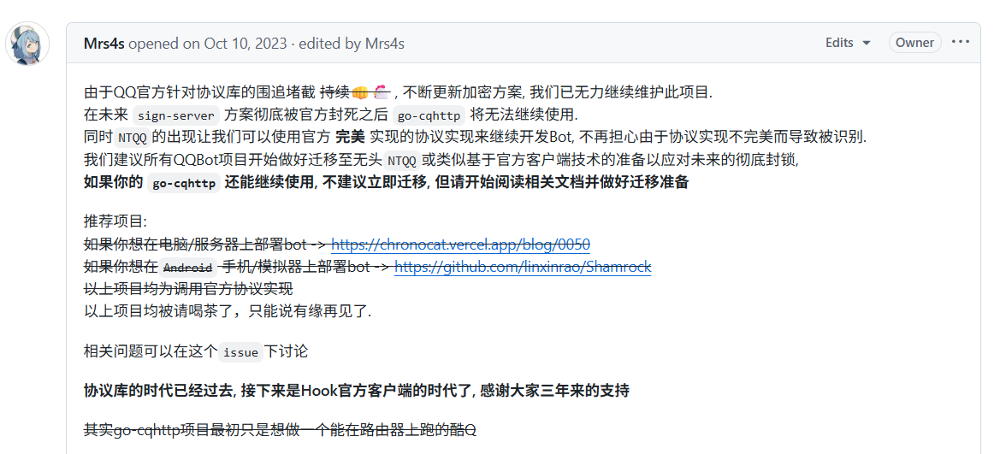
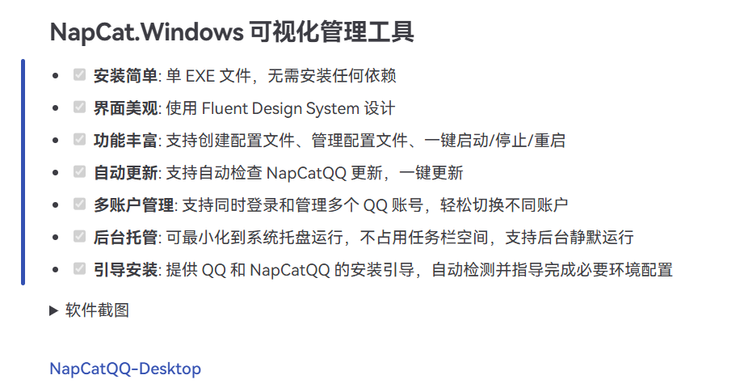
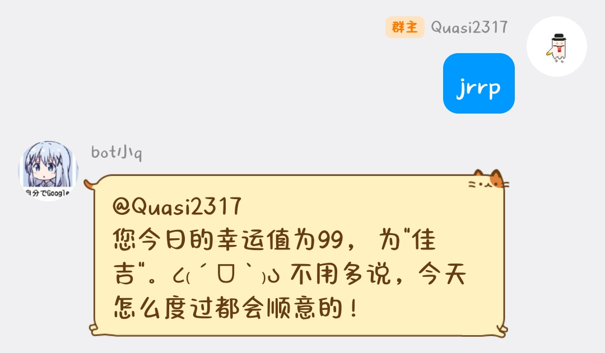
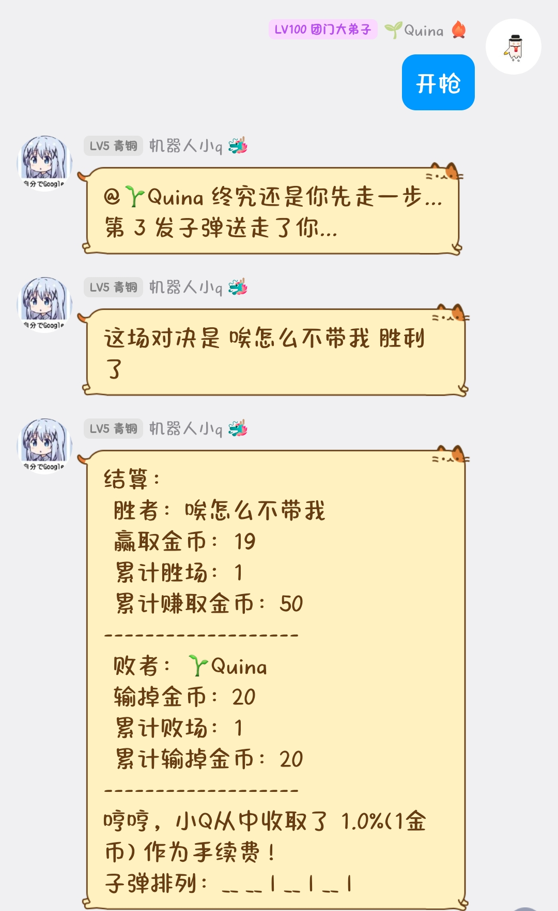

## 0x00 QQ机器人是如何工作的

这需要一个协议端和一个机器人框架，协议端是第三方的QQ客户端，负责登录 QQ 账号，接收和发送 QQ 消息。机器人框架端通过**OneBot 协议**(使用HTTP API或者Websocket)来进行通信，进而处理消息逻辑，调用功能插件。两者配合，协同工作完成 QQ 群聊机器人的功能。

## 0x01 关于机器人框架

框架我用[nonebot2](https://nonebot.dev/)，因为他有活跃的社区和[插件市场](https://nonebot.dev/store/plugins)，仅仅装几个插件就可以满足我的群聊日常使用了(因为我以前群里寄掉的机器人就是nonebot做的)。而且有完善的安装引导和教程，简化了很多很多用户的操作步骤。

命令行安装很简单一路设置就OK了，这部分他指南里写得相当详细了，按照[快速上手](https://nonebot.dev/docs/quick-start)一路配置好之后，框架这边就算是准备好了。

这里推荐一个更实用的初始项目新建工具：
::github{repo="lgc-NB2Dev/nb-cli-plugin-bootstrap"}

他提供了很多批处理脚本，做了很多优化。
## 0x02 关于协议端

我在B站看到的教程大多是用的是gocqhttp做协议端，有直接的nonebot插件，它通过OneBot协议
与nonebot对接，可以很轻松地完成通信，但我在nonebot市场上找不到，在GitHub上搜索，发现已经停止维护了。
1

这就很悲伤了，但单单客户端是没办法完成qq登录获取消息的，后面我看二叉树树的视频[《手把手教你搭建 qqbot》](https://www.bilibili.com/video/BV1JFX7YHEAu/)了解到了新的神级协议端Napcat。他的手册上提供了这么多种方式，直接选择最简单的NapCat Desktop，因为这种GUI操作界面开发者可以帮你做了绝大部分的事情，你需要做的无非是点点鼠标（一个惯用GitHub Desktop小白的经验）事实确实这样，什么都帮你配置好了，你只需要添加机器人的基本配置，连接配置(选择 **WebSocket 客户端**（即反向 WebSocket），让NapCat 主动连接 NoneBot2即可)

这个一般来说是会生效的，配置保存在`config/onebot11_你的QQ号.json` 文件中的 `websocketClients` 数组里。但是我遇到了问题，不知道是不是bug，我的Nonebot那边始终没有连接上的消息弹出，我是手动修改的json文件完成的配置，不过好在最终完成了。

## 0x03 插件的安装

完成前两步，准备好协议端，框架，并将他们连接起来之后，就可以让qqbot处理消息了。后面就是插件的安装，现有的插件的组合已经可以搭建出一个有强大功能的机器人了，下面推荐几个我装的插件。

### 1. llmchat

::github{repo="FuQuan233/nonebot-plugin-llmchat"}

这个插件是AI聊天用的，AI有多强，bot就有多强，支持多API预设、MCP协议、联网搜索、视觉模型。AI真是太好用了你们知道么。配置起来也很容易，直接在nonebot2 项目的`.env`文件中填就完事了。

### 2.今日人品(jrrp)

::github{repo="Florenz0707/nonebot-plugin-flo-luck"}

测人品值的，和隔壁幽幽子一样，其实我做这个主要也是为了这个功能，以前群里的机器人也是这个功能，深受大家喜爱。

### 3.俄罗斯轮盘赌

::github{repo="HibiKier/nonebot_plugin_russian"}

小游戏，以前在数学建模群里的时候大家玩得不亦乐乎。

## 0x04 总结

补充一个启动顺序：必须先启动 NoneBot2，再启动 NapCat Desktop(这不废话么)

OK了，虽然NapCat的力量过于强大，怕腾子对他下重手，所以尽可能避免宣传引流，但我的博客没有流量hhhh，应该问题不大。

搭建的过程遇到了挺多问题的，但最后搭出来玩得还是很开心的。